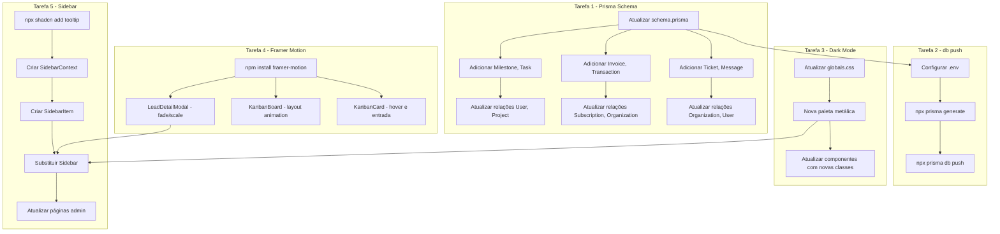

# Plano de Expansão — Soberior OS v0.2.0

## Objetivo

Expandir a arquitetura atual do Soberior OS (CRM B2B) para suportar três novos domínios:

1. **ERP/Faturamento** — `Invoice` e `Transaction`
2. **Gestão de Projetos** — `Milestone` e `Task`
3. **Helpdesk Omnichannel** — `Ticket` e `Message` (Portal + WhatsApp)

Além disso, atualizar o design system (Dark Mode), adicionar animações com `framer-motion` e substituir a navegação por uma Sidebar retrátil.

---

## Tarefa 1 — Modelos Prisma

### 1.1 Novos Modelos

```prisma
// ============================================================
// GESTÃO DE PROJETOS
// ============================================================

model Milestone {
  id          String   @id @default(uuid())
  projectId   String
  project     Project  @relation(fields: [projectId], references: [id], onDelete: Cascade)
  title       String
  description String?
  dueDate     DateTime?
  status      String   @default("PENDING") // PENDING | IN_PROGRESS | COMPLETED | CANCELLED
  completedAt DateTime?
  createdAt   DateTime @default(now())
  updatedAt   DateTime @updatedAt

  @@index([projectId])
}

model Task {
  id          String     @id @default(uuid())
  projectId   String
  project     Project    @relation(fields: [projectId], references: [id], onDelete: Cascade)
  milestoneId String?
  milestone   Milestone? @relation(fields: [milestoneId], references: [id], onDelete: SetNull)
  title       String
  description String?
  status      String     @default("TODO") // TODO | IN_PROGRESS | DONE | BLOCKED
  priority    String     @default("MEDIUM") // LOW | MEDIUM | HIGH | URGENT
  assigneeId  String?
  assignee    User?      @relation(fields: [assigneeId], references: [id], onDelete: SetNull)
  dueDate     DateTime?
  createdAt   DateTime   @default(now())
  updatedAt   DateTime   @updatedAt

  @@index([projectId])
  @@index([milestoneId])
  @@index([assigneeId])
}

// ============================================================
// ERP / FATURAMENTO
// ============================================================

model Invoice {
  id             String       @id @default(uuid())
  subscriptionId String?
  subscription   Subscription? @relation(fields: [subscriptionId], references: [id], onDelete: SetNull)
  organizationId String
  organization   Organization @relation(fields: [organizationId], references: [id], onDelete: Cascade)
  asaasId        String?      @unique
  amount         Float
  status         String       @default("PENDING") // PENDING | PAID | OVERDUE | CANCELLED | REFUNDED
  dueDate        DateTime
  paidAt         DateTime?
  description    String?
  createdAt      DateTime     @default(now())
  updatedAt      DateTime     @updatedAt

  @@index([organizationId])
  @@index([subscriptionId])
  @@index([status])
}

model Transaction {
  id             String       @id @default(uuid())
  subscriptionId String?
  subscription   Subscription? @relation(fields: [subscriptionId], references: [id], onDelete: SetNull)
  organizationId String
  organization   Organization @relation(fields: [organizationId], references: [id], onDelete: Cascade)
  invoiceId      String?
  invoice        Invoice?     @relation(fields: [invoiceId], references: [id], onDelete: SetNull)
  asaasId        String?      @unique
  type           String       // CHARGE | REFUND | PAYMENT | FEE
  amount         Float
  status         String       @default("PENDING") // PENDING | CONFIRMED | FAILED
  description    String?
  createdAt      DateTime     @default(now())

  @@index([organizationId])
  @@index([subscriptionId])
  @@index([invoiceId])
}

// ============================================================
// HELPDESK OMNICHANNEL
// ============================================================

model Ticket {
  id             String   @id @default(uuid())
  organizationId String
  organization   Organization @relation(fields: [organizationId], references: [id], onDelete: Cascade)
  userId         String?
  user           User?    @relation(fields: [userId], references: [id], onDelete: SetNull)
  subject        String
  description    String?
  status         String   @default("OPEN") // OPEN | IN_PROGRESS | WAITING_CUSTOMER | RESOLVED | CLOSED
  priority       String   @default("MEDIUM") // LOW | MEDIUM | HIGH | URGENT
  source         String   @default("PORTAL") // PORTAL | WHATSAPP
  assignedToId   String?
  assignedTo     User?    @relation("TicketAssignment", fields: [assignedToId], references: [id], onDelete: SetNull)
  closedAt       DateTime?
  createdAt      DateTime @default(now())
  updatedAt      DateTime @updatedAt
  messages       Message[]

  @@index([organizationId])
  @@index([userId])
  @@index([status])
  @@index([source])
}

model Message {
  id        String   @id @default(uuid())
  ticketId  String
  ticket    Ticket   @relation(fields: [ticketId], references: [id], onDelete: Cascade)
  userId    String?
  user      User?    @relation(fields: [userId], references: [id], onDelete: SetNull)
  content   String
  source    String   @default("PORTAL") // PORTAL | WHATSAPP
  isFromStaff Boolean @default(false)
  createdAt DateTime @default(now())

  @@index([ticketId])
}
```

### 1.2 Atualizações em Modelos Existentes

**User** — adicionar relação reversa para `Task` (assignee) e `Ticket` (creator/assignee):

```prisma
model User {
  // ... campos existentes ...
  tasks          Task[]    // tarefas atribuídas
  tickets        Ticket[]  // tickets criados pelo usuário
  assignedTickets Ticket[] @relation("TicketAssignment") // tickets atribuídos
}
```

**Project** — adicionar relação reversa para `Milestone` e `Task`:

```prisma
model Project {
  // ... campos existentes ...
  milestones    Milestone[]
  tasks         Task[]
}
```

**Subscription** — adicionar relação reversa para `Invoice` e `Transaction`:

```prisma
model Subscription {
  // ... campos existentes ...
  invoices      Invoice[]
  transactions  Transaction[]
}
```

**Organization** — adicionar relação reversa para `Invoice`, `Transaction`, `Ticket`:

```prisma
model Organization {
  // ... campos existentes ...
  invoices      Invoice[]
  transactions  Transaction[]
  tickets       Ticket[]
}
```

### 1.3 Arquivos a modificar

| Arquivo                | Ação                                                          |
| ---------------------- | ------------------------------------------------------------- |
| `prisma/schema.prisma` | Adicionar modelos + atualizar relações nos modelos existentes |

---

## Tarefa 2 — Prisma db push na VPS

### 2.1 Pré-requisitos

- O arquivo `.env` deve conter `DATABASE_URL` apontando para `postgresql://...@82.25.85.170:5432/...`
- O Prisma CLI precisa do driver PostgreSQL (`pg`) já instalado (presente em `package.json`)

### 2.2 Comandos

```bash
# 1. Gerar cliente Prisma atualizado
npx prisma generate

# 2. Aplicar schema no banco PostgreSQL da VPS
npx prisma db push
```

### 2.3 Arquivos a modificar

| Arquivo                       | Ação                                        |
| ----------------------------- | ------------------------------------------- |
| `.env` (criar se não existir) | Garantir `DATABASE_URL` com IP 82.25.85.170 |

---

## Tarefa 3 — Dark Mode Nativo (Paleta Metálica)

### 3.1 Novas Cores

| Token                  | Valor Atual | Novo Valor |
| ---------------------- | ----------- | ---------- |
| `--background`         | `#0B1320`   | `#09090b`  |
| `--foreground`         | `#FFFFFF`   | `#FAFAFA`  |
| `--card`               | `#143D59`   | `#18181b`  |
| `--card-foreground`    | `#FFFFFF`   | `#FAFAFA`  |
| `--popover`            | `#143D59`   | `#18181b`  |
| `--popover-foreground` | `#FFFFFF`   | `#FAFAFA`  |
| `--border`             | `#1E293B`   | `#27272a`  |
| `--input`              | `#1E293B`   | `#27272a`  |
| `--muted`              | `#1E293B`   | `#27272a`  |
| `--muted-foreground`   | `#94A3B8`   | `#a1a1aa`  |
| `--sidebar`            | `#0B1320`   | `#09090b`  |
| `--sidebar-border`     | `#1E293B`   | `#27272a`  |
| `--sidebar-accent`     | `#143D59`   | `#18181b`  |
| `--sidebar-foreground` | `#94A3B8`   | `#a1a1aa`  |

### 3.2 Detalhes Metálicos (novos tokens)

Adicionar ao `@theme inline`:

```css
--color-zinc-800: #27272a;
--color-zinc-900: #18181b;
--color-zinc-950: #09090b;
--color-metallic: #d4d4d8; /* texto metálico claro */
--color-metallic-muted: #a1a1aa; /* texto metálico médio */
--color-metallic-border: #3f3f46; /* borda metálica sutil */
```

### 3.3 Arquivos a modificar

| Arquivo                              | Ação                                                                                         |
| ------------------------------------ | -------------------------------------------------------------------------------------------- |
| `src/app/globals.css`                | Substituir valores de `:root` com nova paleta e adicionar tokens metálicos                   |
| `src/components/layout/sidebar.tsx`  | Substituir `bg-[#0B1320]` por `bg-zinc-950` e `border-[#1E293B]` por `border-zinc-800`       |
| `src/components/layout/header.tsx`   | Substituir `bg-[#0B1320]/80` por `bg-zinc-950/80` e `border-[#1E293B]` por `border-zinc-800` |
| `src/app/(admin)/page.tsx`           | Substituir `bg-[#0B1320]` por `bg-zinc-950`                                                  |
| `src/app/(admin)/leads/new/page.tsx` | Substituir `bg-[#0B1320]` por `bg-zinc-950`                                                  |
| `src/app/(admin)/settings/page.tsx`  | Substituir `bg-[#0B1320]` por `bg-zinc-950`                                                  |

---

## Tarefa 4 — Framer Motion + Transições

### 4.1 Instalação

```bash
npm install framer-motion
```

### 4.2 LeadDetailModal — Animação de entrada/saída

Envolver o conteúdo do `DialogContent` com `motion.div` para fade + scale:

```tsx
import { motion, AnimatePresence } from "framer-motion";

// Dentro do DialogContent
<AnimatePresence>
  {open && (
    <motion.div
      initial={{ opacity: 0, scale: 0.95 }}
      animate={{ opacity: 1, scale: 1 }}
      exit={{ opacity: 0, scale: 0.95 }}
      transition={{ duration: 0.2, ease: "easeOut" }}
    >
      {children}
    </motion.div>
  )}
</AnimatePresence>;
```

### 4.3 KanbanBoard — Cards com layout animation

Envolver as colunas com `motion.div` para animar reordenação:

```tsx
import { motion, AnimatePresence } from "framer-motion";

// No KanbanBoard, cada coluna
<motion.div
  layout
  transition={{ type: "spring", stiffness: 300, damping: 30 }}
>
  <KanbanColumn ... />
</motion.div>
```

### 4.4 KanbanCard — Animação de hover e aparecimento

```tsx
<motion.div
  initial={{ opacity: 0, y: 10 }}
  animate={{ opacity: 1, y: 0 }}
  whileHover={{ scale: 1.02 }}
  transition={{ duration: 0.15 }}
>
  {/* conteúdo do card */}
</motion.div>
```

### 4.5 Arquivos a modificar

| Arquivo                                       | Ação                                                          |
| --------------------------------------------- | ------------------------------------------------------------- |
| `src/components/kanban/lead-detail-modal.tsx` | Adicionar `motion.div` + `AnimatePresence`                    |
| `src/components/kanban/kanban-board.tsx`      | Adicionar `motion.div` com `layout` nas colunas               |
| `src/components/kanban/kanban-card.tsx`       | Adicionar `motion.div` com `initial`, `animate`, `whileHover` |

---

## Tarefa 5 — Sidebar Retrátil Collapsível

### 5.1 Estratégia

Criar uma nova Sidebar que:

- Por padrão, exibe **apenas ícones** (estado retraído, ~64px de largura)
- Ao clicar no botão de expandir (hamburger/chevron), expande para ~256px mostrando labels
- Mantém estado via `useState` + `localStorage` para persistir preferência
- Usa `Tooltip` do shadcn/ui para mostrar o label quando retraído
- Transição suave com `motion.div` (framer-motion)

### 5.2 Estrutura da Nova Sidebar

```
src/components/layout/
├── sidebar.tsx          (substituir implementação atual)
├── sidebar-item.tsx     (novo) — item individual com tooltip
└── sidebar-context.tsx  (novo) — contexto para estado collapsível
```

### 5.3 Itens de Navegação Expandidos

```typescript
const navItems: NavItem[] = [
  { label: "Dashboard", href: "/", icon: LayoutDashboard },
  { label: "Novo Lead", href: "/leads/new", icon: PlusCircle },
  { label: "Projetos", href: "/projects", icon: Briefcase }, // NOVO
  { label: "Tickets", href: "/tickets", icon: Headset }, // NOVO
  { label: "Faturas", href: "/invoices", icon: Receipt }, // NOVO
  { label: "Configurações", href: "/settings", icon: Settings },
];
```

### 5.4 Componente shadcn/ui necessário

Adicionar o componente `Tooltip` do shadcn:

```bash
npx shadcn@latest add tooltip
```

### 5.5 SidebarContext

```tsx
"use client";
import {
  createContext,
  useContext,
  useState,
  useEffect,
  ReactNode,
} from "react";

interface SidebarContextType {
  collapsed: boolean;
  toggle: () => void;
}

const SidebarContext = createContext<SidebarContextType>({
  collapsed: false,
  toggle: () => {},
});

export function SidebarProvider({ children }: { children: ReactNode }) {
  const [collapsed, setCollapsed] = useState(false);

  useEffect(() => {
    const stored = localStorage.getItem("sidebar-collapsed");
    if (stored) setCollapsed(stored === "true");
  }, []);

  const toggle = () => {
    setCollapsed((prev) => {
      localStorage.setItem("sidebar-collapsed", String(!prev));
      return !prev;
    });
  };

  return (
    <SidebarContext.Provider value={{ collapsed, toggle }}>
      {children}
    </SidebarContext.Provider>
  );
}

export const useSidebar = () => useContext(SidebarContext);
```

### 5.6 SidebarItem

```tsx
"use client";
import Link from "next/link";
import { usePathname } from "next/navigation";
import { LucideIcon } from "lucide-react";
import { cn } from "@/lib/utils";
import { useSidebar } from "./sidebar-context";
import {
  Tooltip,
  TooltipContent,
  TooltipProvider,
  TooltipTrigger,
} from "@/components/ui/tooltip";

interface SidebarItemProps {
  item: { label: string; href: string; icon: LucideIcon };
}

export function SidebarItem({ item }: SidebarItemProps) {
  const pathname = usePathname();
  const { collapsed } = useSidebar();
  const isActive = pathname === item.href;

  const link = (
    <Link
      href={item.href}
      className={cn(
        "flex items-center gap-3 px-3 py-2.5 rounded-lg text-sm font-medium transition-all duration-200",
        isActive
          ? "bg-zinc-800 text-[#F2C14E]"
          : "text-zinc-400 hover:bg-zinc-800/50 hover:text-zinc-200",
      )}
    >
      <item.icon className="w-5 h-5 shrink-0" />
      {!collapsed && <span>{item.label}</span>}
    </Link>
  );

  if (collapsed) {
    return (
      <TooltipProvider delayDuration={0}>
        <Tooltip>
          <TooltipTrigger asChild>{link}</TooltipTrigger>
          <TooltipContent
            side="right"
            className="bg-zinc-900 border-zinc-800 text-zinc-200"
          >
            {item.label}
          </TooltipContent>
        </Tooltip>
      </TooltipProvider>
    );
  }

  return link;
}
```

### 5.7 Sidebar Principal (Substituição)

```tsx
"use client";
import Link from "next/link";
import { motion } from "framer-motion";
import {
  LayoutDashboard,
  PlusCircle,
  Briefcase,
  Headset,
  Receipt,
  Settings,
  PanelLeftClose,
  PanelLeft,
  LucideIcon,
} from "lucide-react";
import { cn } from "@/lib/utils";
import { APP_NAME } from "@/config/constants";
import { SidebarProvider, useSidebar } from "./sidebar-context";
import { SidebarItem } from "./sidebar-item";

interface NavItem {
  label: string;
  href: string;
  icon: LucideIcon;
}

const navItems: NavItem[] = [
  { label: "Dashboard", href: "/", icon: LayoutDashboard },
  { label: "Novo Lead", href: "/leads/new", icon: PlusCircle },
  { label: "Projetos", href: "/projects", icon: Briefcase },
  { label: "Tickets", href: "/tickets", icon: Headset },
  { label: "Faturas", href: "/invoices", icon: Receipt },
  { label: "Configurações", href: "/settings", icon: Settings },
];

function SidebarContent() {
  const { collapsed, toggle } = useSidebar();

  return (
    <motion.aside
      layout
      transition={{ type: "spring", stiffness: 300, damping: 30 }}
      className={cn(
        "h-screen flex-shrink-0 bg-zinc-950 border-r border-zinc-800 flex flex-col",
        collapsed ? "w-16" : "w-64",
      )}
    >
      {/* Header */}
      <div
        className={cn(
          "flex items-center gap-2 p-4 border-b border-zinc-800",
          collapsed ? "justify-center" : "justify-between",
        )}
      >
        {!collapsed && (
          <h1 className="text-xl font-bold text-[#F2C14E] tracking-tight truncate">
            {APP_NAME}
          </h1>
        )}
        <button
          onClick={toggle}
          className="p-1.5 rounded-lg text-zinc-400 hover:text-zinc-200 hover:bg-zinc-800 transition-colors"
        >
          {collapsed ? (
            <PanelLeft className="w-5 h-5" />
          ) : (
            <PanelLeftClose className="w-5 h-5" />
          )}
        </button>
      </div>

      {/* Navigation */}
      <nav className="flex-1 p-3 space-y-1">
        {navItems.map((item) => (
          <SidebarItem key={item.href} item={item} />
        ))}
      </nav>

      {/* Footer */}
      {!collapsed && (
        <div className="p-4 border-t border-zinc-800">
          <p className="text-[10px] text-zinc-500 font-mono">
            v0.2.0 • {APP_NAME}
          </p>
        </div>
      )}
    </motion.aside>
  );
}

export default function Sidebar() {
  return (
    <SidebarProvider>
      <SidebarContent />
    </SidebarProvider>
  );
}
```

### 5.8 Arquivos a modificar/criar

| Arquivo                                     | Ação                                             |
| ------------------------------------------- | ------------------------------------------------ |
| `src/components/layout/sidebar.tsx`         | Substituir completamente pela nova implementação |
| `src/components/layout/sidebar-context.tsx` | **Criar** — contexto de estado collapsível       |
| `src/components/layout/sidebar-item.tsx`    | **Criar** — item de navegação com tooltip        |
| `src/components/ui/tooltip.tsx`             | Adicionar via `npx shadcn@latest add tooltip`    |

---

## Mapa de Dependências



## Ordem de Execução

| Passo | Tarefa         | Descrição                                                             |
| ----- | -------------- | --------------------------------------------------------------------- |
| 1     | Schema         | Atualizar `prisma/schema.prisma` com novos modelos e relações         |
| 2     | db push        | Executar `npx prisma db push` na VPS                                  |
| 3     | Paleta         | Atualizar `globals.css` com nova paleta metálica dark                 |
| 4     | CSS Components | Atualizar `bg-[...]` e `border-[...]` nos componentes de layout       |
| 5     | Framer         | Instalar `framer-motion`                                              |
| 6     | Framer         | Adicionar animações no `LeadDetailModal`, `KanbanBoard`, `KanbanCard` |
| 7     | Tooltip        | Adicionar `Tooltip` do shadcn/ui                                      |
| 8     | Sidebar        | Criar `SidebarContext`, `SidebarItem`, nova `Sidebar` collapsível     |

---

## Riscos e Observações

1. **db push destrutivo?** `prisma db push` não destrói dados existentes, apenas adiciona novas tabelas/colunas. Seguro para aplicar em produção.
2. **Paleta existente**: Muitos componentes usam cores hardcoded (`bg-[#0B1320]`, `border-[#1E293B]`, `bg-[#143D59]`). A atualização de paleta deve substituir **todas** as ocorrências.
3. **Layout quebrado**: A Sidebar collapsível muda a largura. Garantir que o layout flex `flex h-screen` com `flex-1` compense corretamente.
4. **Framer x Base UI**: Verificar se `AnimatePresence` não conflita com as animações nativas do `@base-ui/react/dialog`. Pode ser necessário desabilitar animações do Base UI.
