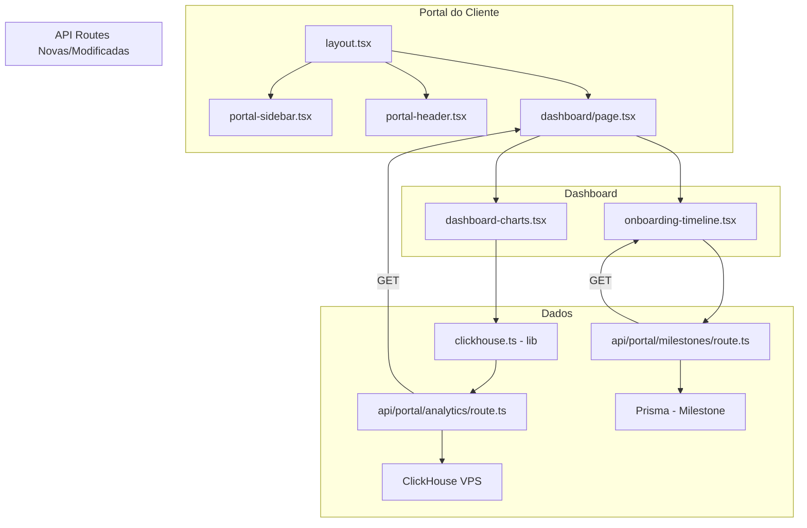
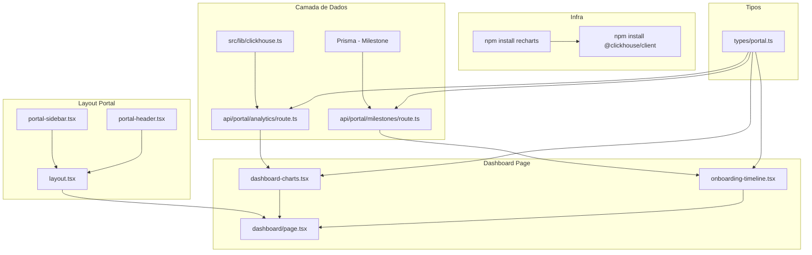

# Plano: Portal do Cliente High-End — Fase 3

## Objetivo

Transformar a experiência do cliente no portal [`/app/(portal)`](<src/app/(portal)>) em uma interface High-End com:

1. Layout próprio com sidebar + header de navegação
2. Dashboard com gráficos Recharts consumindo dados analíticos do ClickHouse (ROAS, Eventos Processados)
3. Timeline de Onboarding interativa baseada nos `Milestones` do Prisma

## Stack Técnica

| Tecnologia                                                                                | Versão | Uso                                                        |
| ----------------------------------------------------------------------------------------- | ------ | ---------------------------------------------------------- |
| [`recharts`](https://recharts.org)                                                        | ^2.x   | Gráficos no dashboard (alternativa ao Tremor)              |
| [`@clickhouse/client`](https://clickhouse.com/docs/en/integrations/language-clients/node) | ^1.x   | Conexão nativa ao ClickHouse na VPS                        |
| shadcn/ui (`chart`)                                                                       | —      | Padrão de componentes de gráfico shadcn (wrapper Recharts) |
| Prisma `Milestone`                                                                        | —      | Dados da timeline de onboarding                            |

## Arquitetura



## Estrutura de Arquivos

```
src/
├── app/(portal)/
│   ├── layout.tsx                  # [CRIAR] Layout do portal (sidebar + header)
│   ├── dashboard/
│   │   └── page.tsx                # [MODIFICAR] Dashboard com gráficos + timeline
│   ├── documentos/
│   │   └── page.tsx                # (inalterado)
│   └── faturas/
│       └── page.tsx                # (inalterado)
├── app/api/portal/
│   ├── dashboard/
│   │   └── route.ts                # [MODIFICAR] Adicionar dados do ClickHouse
│   ├── analytics/
│   │   └── route.ts                # [CRIAR] Dados analíticos do ClickHouse (ROAS, eventos)
│   └── milestones/
│       └── route.ts                # [CRIAR] Milestones do projeto do cliente
├── components/portal/
│   ├── portal-sidebar.tsx          # [CRIAR] Sidebar de navegação do portal
│   ├── portal-header.tsx           # [CRIAR] Header do portal
│   ├── dashboard-charts.tsx        # [CRIAR] Gráficos Recharts (ROAS, Eventos)
│   └── onboarding-timeline.tsx     # [CRIAR] Timeline interativa de milestones
├── lib/
│   └── clickhouse.ts               # [CRIAR] Cliente nativo ClickHouse
└── types/
    └── portal.ts                   # [CRIAR] Tipos específicos do portal
```

---

## Tarefa 1 — Instalar Dependências

```bash
npm install recharts @clickhouse/client
```

**Arquivos afetados:**
| Arquivo | Ação |
|---|---|
| `package.json` | Adicionar `recharts` e `@clickhouse/client` |

---

## Tarefa 2 — Utilitário ClickHouse (`src/lib/clickhouse.ts`)

Criar cliente singleton para conexão nativa ao ClickHouse.

**Credenciais:**

- Host: `82.25.85.170`
- Port: `8123` (HTTP padrão) ou `9000` (TCP)
- Usuário: `soberior_data`
- Senha: `kP9$mX2!vL7*qZ5N`
- Database: `soberior_analytics`

**Funcionalidades:**

- Conexão via `@clickhouse/client` (protocolo HTTP)
- Funções query helpers: `queryRows(sql)`, `queryOne(sql)`
- Tipagem genérica para resultados
- Singleton pattern (similar a [`src/lib/prisma.ts`](src/lib/prisma.ts))

**Exemplo de uso:**

```typescript
import { clickhouse } from "@/lib/clickhouse";

// Query ROAS dos últimos 30 dias
const roas = await clickhouse.queryRows<{ date: string; roas: number }>(
  `SELECT toDate(event_time) as date, avg(roas) as roas 
   FROM soberior_analytics.events 
   WHERE organization_id = {orgId:String}
   AND event_time >= now() - INTERVAL 30 DAY
   GROUP BY date ORDER BY date`,
);
```

**Arquivos afetados:**
| Arquivo | Ação |
|---|---|
| `src/lib/clickhouse.ts` | **CRIAR** — Cliente ClickHouse singleton |
| `.env` | Garantir vars `CLICKHOUSE_*` (se não existirem, adicionar) |

---

## Tarefa 3 — Layout Compartilhado do Portal (`src/app/(portal)/layout.tsx`)

Criar layout em `src/app/(portal)` que:

- Importa e renderiza [`portal-sidebar.tsx`](src/components/portal/portal-sidebar.tsx) e [`portal-header.tsx`](src/components/portal/portal-header.tsx)
- Usa o esquema de cores do portal (deve seguir as cores do Soberior: `--color-deep-navy`, `--color-midnight-blue`, etc.)
- Mantém o sidebar fixo à esquerda com transição suave

```tsx
export default function PortalLayout({
  children,
}: {
  children: React.ReactNode;
}) {
  return (
    <div className="flex h-screen bg-deep-navy">
      <PortalSidebar />
      <div className="flex-1 flex flex-col overflow-hidden">
        <PortalHeader />
        <main className="flex-1 overflow-auto p-6">{children}</main>
      </div>
    </div>
  );
}
```

**Arquivos afetados:**
| Arquivo | Ação |
|---|---|
| `src/app/(portal)/layout.tsx` | **CRIAR** — Layout com sidebar + header |

---

## Tarefa 4 — Componentes de Navegação do Portal

### 4.1 Portal Sidebar ([`src/components/portal/portal-sidebar.tsx`](src/components/portal/portal-sidebar.tsx))

Sidebar fixa à esquerda com:

- Logo "SOBERIOR" em destaque
- Itens de navegação: Dashboard (`/dashboard`), Documentos (`/documentos`), Faturas (`/faturas`)
- Ícones do lucide-react para cada item
- Destaque no item ativo (via `usePathname`)
- Opção de collapse (similar ao padrão do admin, mas versão portal)

### 4.2 Portal Header ([`src/components/portal/portal-header.tsx`](src/components/portal/portal-header.tsx))

Header superior com:

- Nome da organização (via sessão)
- Avatar/Iniciais do usuário
- Botão de logout

**Arquivos afetados:**
| Arquivo | Ação |
|---|---|
| `src/components/portal/portal-sidebar.tsx` | **CRIAR** |
| `src/components/portal/portal-header.tsx` | **CRIAR** |

---

## Tarefa 5 — API Route de Analytics do ClickHouse

### 5.1 Nova API Route ([`src/app/api/portal/analytics/route.ts`](src/app/api/portal/analytics/route.ts))

Endpoint `GET /api/portal/analytics` que:

- Autentica via `getServerSession()`
- Obtém `organizationId` da sessão
- Busca dados no ClickHouse filtrando pela organização:
  - **ROAS diário** (últimos 30 dias)
  - **Eventos Processados** (últimos 30 dias)
  - **ROAS acumulado** (mês atual)
  - **Total de eventos** (mês atual)
- Retorna dados estruturados para os gráficos

### 5.2 Modificar API Route existente ([`src/app/api/portal/dashboard/route.ts`](src/app/api/portal/dashboard/route.ts))

Adicionar dados do ClickHouse ao retorno existente, ou manter separado. **Decisão:** manter separado para não acoplar dados de analytics com dados do Prisma.

**Arquivos afetados:**
| Arquivo | Ação |
|---|---|
| `src/app/api/portal/analytics/route.ts` | **CRIAR** |

---

## Tarefa 6 — Dashboard com Gráficos Recharts

### 6.1 Componente de Charts ([`src/components/portal/dashboard-charts.tsx`](src/components/portal/dashboard-charts.tsx))

Componente `use client` que renderiza:

- **Área Chart (ROAS)** — Variação do ROAS nos últimos 30 dias (gradiente dourado)
- **Bar Chart (Eventos)** — Eventos processados por dia (azul teal)
- **Cards de Métricas** — ROAS médio do mês, Total de Eventos, ROAS Acumulado

Usar `recharts`:

- `AreaChart`, `Area`, `XAxis`, `YAxis`, `Tooltip`, `ResponsiveContainer` para ROAS
- `BarChart`, `Bar`, `XAxis`, `YAxis`, `Tooltip`, `ResponsiveContainer` para Eventos
- Paleta de cores: `#F2C14E` (dourado) para ROAS, `#1F7A8C` (teal) para eventos

### 6.2 Dashboard ([`src/app/(portal)/dashboard/page.tsx`](<src/app/(portal)/dashboard/page.tsx>))

Modificar o dashboard para:

1. Remover **qualquer referência a iframe** (atualmente não há, mas garantir)
2. Manter os cards de resumo (Estágio, Uptime, Plano, Status) — já existem
3. Adicionar a seção de gráficos Recharts abaixo dos cards
4. Adicionar a Timeline de Onboarding
5. Integrar fetching dos dados: dados do Prisma (via `/api/portal/dashboard`) + dados ClickHouse (via `/api/portal/analytics`)

**Layout do Dashboard:**

```
┌─────────────────────────────────────────┐
│  Header: "Olá, {Nome}"                  │
├─────────────────────────────────────────┤
│  Cards de Resumo (4 colunas)            │
│  ┌──────┐ ┌──────┐ ┌──────┐ ┌──────┐  │
│  │Estágio│ │Uptime│ │ Plano│ │Status│  │
│  └──────┘ └──────┘ └──────┘ └──────┘  │
├─────────────────────────────────────────┤
│  Gráficos Analytics (2 colunas)         │
│  ┌─────────────────┐ ┌────────────────┐ │
│  │   ROAS (Area)    │ │  Eventos (Bar) │ │
│  └─────────────────┘ └────────────────┘ │
├─────────────────────────────────────────┤
│  Timeline de Onboarding                 │
│  ┌─────────────────────────────────────┐│
│  │  ● GTM Server Container    [DONE]  ││
│  │  ● Stape Config            [DONE]  ││
│  │  ● Domain Setup            [DONE]  ││
│  │  ● Tags Validation        [ACTIVE] ││
│  │  ● QBR Review            [PENDING] ││
│  └─────────────────────────────────────┘│
└─────────────────────────────────────────┘
```

**Arquivos afetados:**
| Arquivo | Ação |
|---|---|
| `src/components/portal/dashboard-charts.tsx` | **CRIAR** |
| `src/app/(portal)/dashboard/page.tsx` | **MODIFICAR** — Adicionar charts + timeline |

---

## Tarefa 7 — Timeline de Onboarding Interativa

### 7.1 API Route de Milestones ([`src/app/api/portal/milestones/route.ts`](src/app/api/portal/milestones/route.ts))

Endpoint `GET /api/portal/milestones` que:

- Autentica via `getServerSession()`
- Busca `organizationId` da sessão
- Encontra o `Project` ativo da organização
- Retorna todos os `Milestone` do projeto ordenados por `dueDate` ou `createdAt`

### 7.2 Componente Timeline ([`src/components/portal/onboarding-timeline.tsx`](src/components/portal/onboarding-timeline.tsx))

Componente interativo que:

- Lista milestones do projeto como uma timeline vertical
- Cada milestone mostra:
  - **Status**: ícone diferente para PENDING (⏳), IN_PROGRESS (🔄), COMPLETED (✅), CANCELLED (❌)
  - **Título**: nome do milestone
  - **Descrição**: opcional, expandível
  - **Data**: dueDate ou completedAt
- Destaque visual para milestones relacionados a:
  - **GTM Server-Side**: milestones com título contendo "GTM", "Server-Side", "Container"
  - **Stape**: milestones com título contendo "Stape"
- Interatividade:
  - Clique para expandir/recolher descrição
  - Hover com efeito visual

### 7.3 Tipos Compartilhados ([`src/types/portal.ts`](src/types/portal.ts))

```typescript
export interface MilestoneData {
  id: string;
  title: string;
  description: string | null;
  status: "PENDING" | "IN_PROGRESS" | "COMPLETED" | "CANCELLED";
  dueDate: string | null;
  completedAt: string | null;
  createdAt: string;
}

export interface AnalyticsData {
  roasDaily: Array<{ date: string; roas: number }>;
  eventsDaily: Array<{ date: string; events: number }>;
  roasMonthly: number;
  totalEvents: number;
}

export interface PortalDashboardData {
  organizationName: string;
  projectStage: string | null;
  uptimeStatus: number | null;
  subscriptionPlan: string | null;
  subscriptionStatus: string | null;
  mrrValue: number | null;
  dueDate: string | null;
}
```

**Arquivos afetados:**
| Arquivo | Ação |
|---|---|
| `src/app/api/portal/milestones/route.ts` | **CRIAR** |
| `src/components/portal/onboarding-timeline.tsx` | **CRIAR** |
| `src/types/portal.ts` | **CRIAR** |

---

## Ordem de Execução

| Passo | Tarefa         | Descrição                                             |
| ----- | -------------- | ----------------------------------------------------- |
| 1     | Dependências   | `npm install recharts @clickhouse/client`             |
| 2     | ClickHouse     | Criar `src/lib/clickhouse.ts`                         |
| 3     | Tipos          | Criar `src/types/portal.ts`                           |
| 4     | API Analytics  | Criar `src/app/api/portal/analytics/route.ts`         |
| 5     | API Milestones | Criar `src/app/api/portal/milestones/route.ts`        |
| 6     | Portal Sidebar | Criar `src/components/portal/portal-sidebar.tsx`      |
| 7     | Portal Header  | Criar `src/components/portal/portal-header.tsx`       |
| 8     | Portal Layout  | Criar `src/app/(portal)/layout.tsx`                   |
| 9     | Charts         | Criar `src/components/portal/dashboard-charts.tsx`    |
| 10    | Timeline       | Criar `src/components/portal/onboarding-timeline.tsx` |
| 11    | Dashboard      | Modificar `src/app/(portal)/dashboard/page.tsx`       |

## Mapa de Dependências



## Riscos e Observações

1. **ClickHouse Connectivity**: O servidor ClickHouse em `82.25.85.170` precisa estar acessível da máquina de desenvolvimento/VPS. Verificar firewall e bind address.
2. **Tabelas ClickHouse**: O schema exato das tabelas no ClickHouse (`soberior_analytics`) é desconhecido. A implementação deve usar nomes de colunas genéricos (`organization_id`, `event_time`, `roas`, `events`) que podem precisar de ajuste.
3. **Recharts + Tailwind v4**: Recharts é independente de Tailwind, sem conflitos. As cores devem ser passadas via props (não classes CSS).
4. **Layout isolado**: O layout do portal (`(portal)/layout.tsx`) substitui o layout root para essas rotas. O layout root [`src/app/layout.tsx`](src/app/layout.tsx) fornece ThemeProvider e AuthProvider que ainda serão aplicados.
5. **Performance**: Dados do ClickHouse são analíticos e podem ter muitas linhas. As queries devem agregar no servidor (GROUP BY + LIMIT) para minimizar payload.
