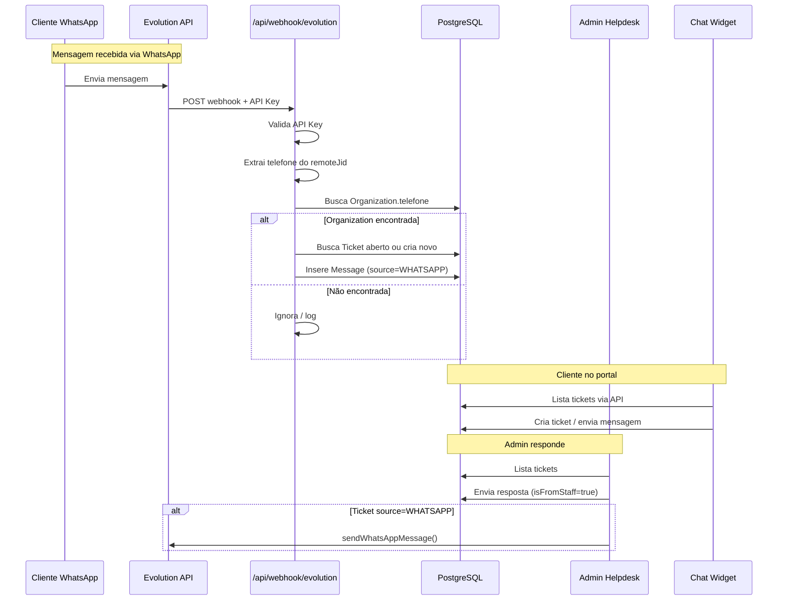

# Módulo Omnichannel — Plano de Implementação

## Visão Geral

Construir o módulo de atendimento Omnichannel com 3 frentes:

1. **Chat Widget (Portal do Cliente)** — interface flutuante na área `/(portal)`
2. **Helpdesk Admin** — página `/(admin)/helpdesk` para gestão de tickets
3. **Webhook Evolution API** — rota `/api/webhook/evolution` para receber mensagens WhatsApp

---

## Arquitetura

```mermaid
flowchart TB
    subgraph "WhatsApp"
        WA[Cliente WhatsApp] --> EV[Evolution API<br/>waba.soberior.com]
    end

    subgraph "Next.js App"
        EV --> WH[/api/webhook/evolution]

        subgraph "Portal do Cliente"
            CW[Chat Widget] --> PT[/api/portal/tickets]
            PT --> DB[(PostgreSQL)]
        end

        subgraph "Admin Helpdesk"
            AH[Helpdesk Page] --> AT[/api/helpdesk/tickets]
            AT --> DB
        end

        WH --> DB
    end

    AH -->|resposta staff| EV

    subgraph "Prisma Models"
        DB --> O[Organization]
        DB --> U[User]
        DB --> T[Ticket]
        DB --> M[Message]
    end
```

## Fluxo de Dados



---

## 1. Types — `src/types/evolution.ts`

Tipagem para o payload recebido no webhook da Evolution API.

```typescript
// Payload típico da Evolution API webhook
export interface EvolutionWebhookPayload {
  event: string;
  instance: string;
  data?: {
    key?: {
      remoteJid?: string; // "5511999999999@s.whatsapp.net"
      fromMe?: boolean;
      id?: string;
    };
    message?: {
      conversation?: string;
      extendedTextMessage?: { text: string };
      imageMessage?: { caption?: string; mimetype: string; url?: string };
    };
    pushName?: string;
  };
}
```

## 2. Webhook Evolution — `src/app/api/webhook/evolution/route.ts`

### Responsabilidades

- Validar API Key (`PlanetaCadeiraVento2026`) via header `x-api-key`
- Extrair phone number do campo `data.key.remoteJid` (formato: `5511999999999@s.whatsapp.net`)
- Limpar o telefone (remover `@s.whatsapp.net`, manter apenas dígitos)
- Buscar `Organization` onde `telefone` contém o número
- Buscar `Ticket` aberto (OPEN ou WAITING_CUSTOMER) para a organization
- Se não existir ticket aberto, criar um novo com `source=WHATSAPP` e subject automático
- Inserir `Message` com `source=WHATSAPP`, `isFromStaff=false`
- Ignorar mensagens com `fromMe=true` (já enviadas pelo sistema)
- Retornar `200 OK` sempre (para não re-enviar o webhook)

## 3. API Portal Tickets — `src/app/api/portal/tickets/`

### `GET /api/portal/tickets`

- Autenticação via `getServerSession`
- Listar tickets da organization do usuário logado
- Incluir contagem de mensagens e última mensagem
- Ordenar por `updatedAt` descendente

### `POST /api/portal/tickets`

- Autenticação via `getServerSession`
- Criar novo ticket com `organizationId`, `userId`, `subject`, `description`, `source=PORTAL`
- Criar primeira `Message` automaticamente com o `content` da descrição

### `GET /api/portal/tickets/[id]/messages`

- Autenticação via `getServerSession`
- Verificar se o ticket pertence à organization do usuário
- Retornar todas as mensagens ordenadas por `createdAt`

### `POST /api/portal/tickets/[id]/messages`

- Autenticação via `getServerSession`
- Criar `Message` com `source=PORTAL`, `isFromStaff=false`, `userId` do cliente

## 4. Portal Chat Widget — `src/components/portal/chat-widget.tsx`

### Layout

- Botão flutuante no canto inferior direito (ícone de chat `MessageCircle`)
- Ao clicar, abre painel lateral (sheet/drawer) que cobre ~400px da direita
- Fundo escuro translúcido com o tema Soberior (zinc-950, zinc-800, #F2C14E)

### Comportamento

- **Lista de Tickets**: exibe tickets do usuário com status, assunto, última mensagem
- **Novo Ticket**: botão "Novo Chamado" abre formulário inline (subject + description)
- **Chat**: ao clicar em um ticket, exibe histórico de mensagens estilo chat (bolhas)
- **Mensagens**: staff à direita (bolha #F2C14E), cliente à esquerda (bolha zinc-800)
- **Input**: campo de texto + botão enviar
- Badge de notificação com quantidade de mensagens não lidas (WAITING_CUSTOMER)

### Estados

- Loading: spinner
- Empty: "Nenhum chamado ativo. Clique em \"Novo Chamado\" para abrir um."
- Error: toast de erro via sonner
- Offline/API error: mensagem amigável

## 5. Admin Helpdesk API — `src/app/api/helpdesk/tickets/`

### `GET /api/helpdesk/tickets`

- Listar todos os tickets
- Suportar filtros: `status`, `source`, `organizationId` (query params)
- Incluir dados da Organization e do User
- Paginação: `page` e `limit` (default 20)

### `GET /api/helpdesk/tickets/[id]`

- Retornar ticket completo com mensagens

### `POST /api/helpdesk/tickets/[id]/messages`

- Admin envia resposta
- `isFromStaff=true`
- Se `ticket.source === "WHATSAPP"`, chamar `sendWhatsAppMessage(phone, content)`
- Atualizar status do ticket para `WAITING_CUSTOMER`

### `PATCH /api/helpdesk/tickets/[id]`

- Atualizar status, prioridade, assignedTo

## 6. Admin Helpdesk Page — `src/app/(admin)/helpdesk/page.tsx`

### Layout (client component)

- Header com título "Helpdesk" e descrição "Atendimento Omnichannel"
- Sidebar: já existe com link para "Tickets" (Headset icon) — ajustar href para `/helpdesk`

### Funcionalidades

- **Filtros**: tabs ou dropdowns para status (OPEN, IN_PROGRESS, WAITING_CUSTOMER, RESOLVED, CLOSED)
- **Lista de Tickets**: tabela ou cards com: assunto, organização, status, prioridade, origem, data, responsável
- **Painel de Chat**: ao selecionar ticket, exibe chat no lado direito (split-view)
- **Formulário de Resposta**: input de texto + botão "Enviar" + atalho Enter

## 7. Ajustes no Layout

### Portal Layout (`src/app/(portal)/layout.tsx`)

- Adicionar `<ChatWidget />` antes do fechamento do `</div>` principal

### Admin Sidebar (`src/components/layout/sidebar.tsx`)

- O link "Tickets" já existe com href `/tickets` — alterar para `/helpdesk`

---

## Checklist de Implementação

- [ ] **Tipos**: criar `src/types/evolution.ts`
- [ ] **Webhook Evolution**: criar `src/app/api/webhook/evolution/route.ts`
- [ ] **API Portal Tickets**: criar CRUD em `src/app/api/portal/tickets/`
- [ ] **Chat Widget**: criar `src/components/portal/chat-widget.tsx`
- [ ] **Integrar Chat Widget**: adicionar no `src/app/(portal)/layout.tsx`
- [ ] **API Helpdesk Admin**: criar CRUD em `src/app/api/helpdesk/tickets/`
- [ ] **Admin Helpdesk Page**: criar `src/app/(admin)/helpdesk/page.tsx`
- [ ] **Ajustar Sidebar Admin**: alterar href de Tickets para `/helpdesk`
