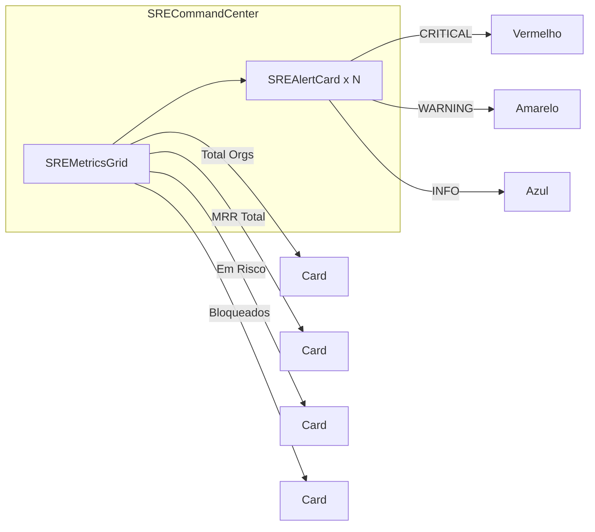
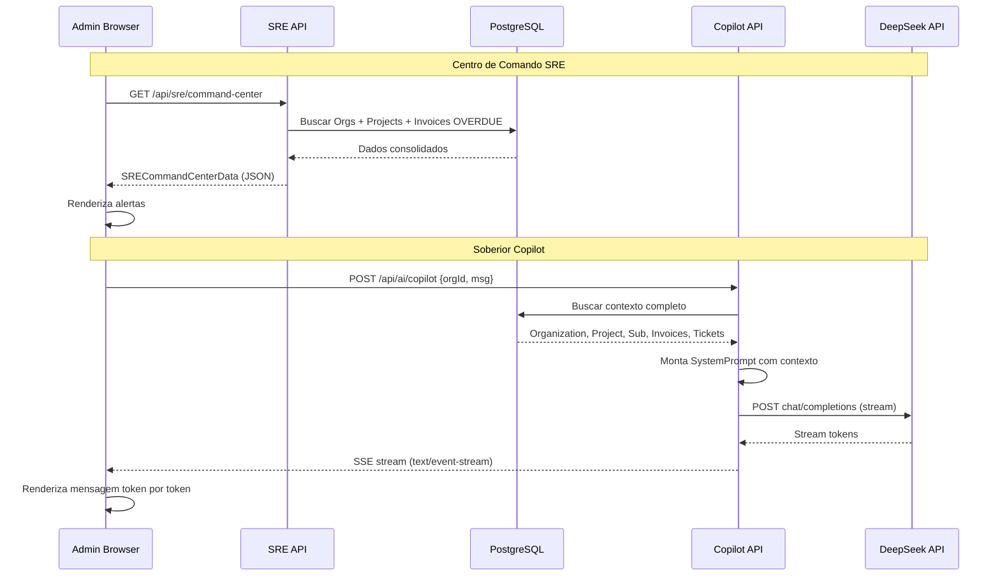

# Plano: Centro de Comando SRE + Soberior Copilot (IA Contextual)

## 1. Visão Geral

Acoplar inteligência artificial contextual e observabilidade no CRM SOBERIOR,
permitindo que administradores tenham visibilidade SRE (Kill Switch alerts) e
conversem com DeepSeek sobre clientes específicos com contexto completo do banco.

### Funcionalidades

1. **Centro de Comando SRE** — Dashboard administrativo com alertas de risco
2. **Soberior Copilot** — Aba lateral com chat IA contextual em modais de Lead e Project
3. **Rota `/api/ai/copilot`** — Endpoint que monta System Prompt completo do cliente e faz streaming com DeepSeek
4. **Chat em tempo real** — Admin conversa com DeepSeek sobre o cliente específico

---

## 2. Arquitetura

```mermaid
flowchart TB
    subgraph Frontend
        AD[Admin Dashboard /] --> SCC[SREC commandCenter]
        LD[LeadDetailModal] --> COP[SoberiorCopilot]
        PD[ProjectDetailModal] --> COP
        COP --> API[/api/ai/copilot]
    end

    subgraph Backend
        API --> CP[CopilotService]
        CP --> PRISMA[Prisma ORM]
        PRISMA --> DB[(PostgreSQL)]
        CP --> DEEPSEEK[DeepSeek API]
        CP --> SSE[Streaming Response]
    end

    subgraph Database
        DB --> ORG[Organization]
        DB --> PROJ[Project]
        DB --> INV[Invoice]
        DB --> SUB[Subscription]
        DB --> TKT[Ticket]
    end

    SCC --> API_SRE[/api/sre/command-center]
    API_SRE --> PRISMA
```

---

## 3. Estrutura de Arquivos

```
src/
├── app/
│   ├── (admin)/
│   │   ├── page.tsx                          # MODIFICAR: importar SRECommandCenter
│   │   └── dashboard/                        # NOVO: rota para página dedicada SRE
│   │       └── page.tsx
│   ├── api/
│   │   ├── ai/
│   │   │   ├── enrich-lead/route.ts          # existente
│   │   │   └── copilot/                      # NOVO: endpoint do Copilot
│   │   │       └── route.ts
│   │   └── sre/                              # NOVO: endpoint do Centro de Comando SRE
│   │       └── command-center/
│   │           └── route.ts
│   └── (portal)/dashboard/page.tsx           # existente
├── components/
│   ├── kanban/
│   │   ├── lead-detail-modal.tsx             # MODIFICAR: adicionar aba Copilot
│   │   └── project-detail-modal.tsx          # NOVO: modal de detalhes do projeto
│   ├── sre/                                  # NOVA pasta
│   │   ├── sre-command-center.tsx            # Componente principal SRE
│   │   ├── sre-alert-card.tsx                # Card de alerta individual
│   │   └── sre-metrics-grid.tsx              # Grid de métricas SRE
│   └── copilot/                              # NOVA pasta
│       ├── soberior-copilot.tsx              # Componente de aba lateral do Copilot
│       └── copilot-chat.tsx                  # Chat em tempo real com streaming
├── lib/
│   ├── deepseek-api.ts                       # MODIFICAR: adicionar função copilotChat
│   └── copilot-service.ts                    # NOVO: lógica de montagem do contexto
└── types/
    ├── api.ts                                # MODIFICAR: adicionar tipos do Copilot
    ├── portal.ts                             # existente
    └── sre.ts                                # NOVO: tipos do SRE Command Center
```

---

## 4. Detalhamento dos Componentes

### 4.1. Tipos

**`src/types/sre.ts`** — Tipos do SRE Command Center

```typescript
export interface SREAlert {
  id: string;
  organizationId: string;
  organizationName: string;
  domain: string | null;
  type: "KILL_SWITCH_EMINENT" | "SUBDOMAIN_DOWN";
  severity: "CRITICAL" | "WARNING" | "INFO";
  message: string;
  daysOverdue?: number;
  uptimeStatus?: number;
  mrrValue: number;
  dueDate: string;
  isActive: boolean;
}

export interface SRECommandCenterData {
  totalOrganizations: number;
  activeOrganizations: number;
  blockedOrganizations: number;
  totalMRR: number;
  alerts: SREAlert[];
}
```

**`src/types/api.ts`** — Adicionar tipos do Copilot

```typescript
export interface CopilotRequest {
  organizationId: string;
  message: string;
  contextType: "LEAD" | "PROJECT";
}

export interface CopilotContext {
  organization: {
    name: string;
    cnpj: string | null;
    domain: string | null;
    email: string | null;
    telefone: string | null;
    isActive: boolean;
  };
  project: {
    stage: string | null;
    uptimeStatus: number | null;
    milestones: Array<{
      title: string;
      status: string;
      dueDate: string | null;
    }>;
  } | null;
  subscription: {
    planType: string | null;
    mrrValue: number | null;
    status: string | null;
    dueDate: string | null;
  } | null;
  invoices: Array<{
    amount: number;
    status: string;
    dueDate: string;
    paidAt: string | null;
  }>;
  tickets: Array<{
    subject: string;
    status: string;
    priority: string;
    createdAt: string;
    messageCount: number;
  }>;
  analytics: {
    totalTickets: number;
    openTickets: number;
    overdueInvoices: number;
    totalOverdueAmount: number;
  };
}
```

### 4.2. API Routes

#### `src/app/api/sre/command-center/route.ts` — Endpoint SRE

- **GET** — Retorna dados consolidados para o Centro de Comando SRE
- Lógica:
  1. Buscar todas as `Organization` com `Project` e `Subscription`
  2. Buscar `Invoice` com status `OVERDUE` ordenadas por `dueDate`
  3. Para cada organização com `Invoice` vencida há >= 3 dias úteis → alerta "Kill Switch Eminente"
  4. Para cada organização com `Project.uptimeStatus < 95%` → alerta "Queda de Subdomínio"
  5. Calcular MRR total, total de ativos/bloqueados

#### `src/app/api/ai/copilot/route.ts` — Endpoint Copilot

- **POST** — Recebe `{ organizationId, message, contextType }`
- Lógica:
  1. Busca contexto completo no Prisma (Organization, Project, Subscription, Invoice, Ticket)
  2. Monta o `SystemPrompt` com todos os dados do cliente
  3. Chama a DeepSeek API em modo streaming (SSE)
  4. Retorna `ReadableStream` para o frontend consumir

### 4.3. Serviço Copilot

**`src/lib/copilot-service.ts`** — Serviço que monta o contexto e System Prompt

```typescript
export async function buildCopilotContext(
  organizationId: string,
): Promise<CopilotContext> {
  // Busca Organization + Project + Subscription + Invoices + Tickets
  // Calcula analytics derivados
  // Retorna objeto CopilotContext
}

export function buildSystemPrompt(context: CopilotContext): string {
  // Monta System Prompt hierárquico com:
  // 1. Identidade do assistente (Soberior Copilot)
  // 2. Dados da organização
  // 3. Dados do projeto (stage, uptime, milestones)
  // 4. Dados da assinatura (plano, MRR, status)
  // 5. Faturas (vencidas, pagas, valores)
  // 6. Tickets abertos/fechados
  // 7. Analytics derivados
  return prompt;
}
```

### 4.4. Componentes Frontend

#### `src/components/sre/sre-command-center.tsx`

- Grid de cards com métricas SRE
- Lista de alertas com severidade CRITICAL, WARNING, INFO
- Cada alerta mostra: organização, dias em atraso, MRR em risco, ações sugeridas
- Ícones: `AlertTriangle` (Kill Switch), `Globe` (Subdomínio)



#### `src/components/copilot/soberior-copilot.tsx`

- Aba lateral usando `Sheet` (gaveta lateral direita)
- Recebe `organizationId` e `contextType` como props
- Dentro: `CopilotChat` para conversação
- Botão de ativar: "Soberior Copilot" com ícone `Bot` ou `Sparkles`

#### `src/components/copilot/copilot-chat.tsx`

- Chat em tempo real com streaming
- Input de texto + botão enviar
- Bolhas de mensagem (usuário à direita, IA à esquerda)
- Loading state com animação de digitação
- Scroll automático para nova mensagem
- Flag `isStreaming` para estado de carregamento

### 4.5. Modificações em Componentes Existentes

#### `LeadDetailModal` — Adicionar aba Copilot

- Inserir `<Tabs>` no conteúdo do Dialog
- Aba 1: "Informações" (conteúdo atual)
- Aba 2: "Soberior Copilot" (novo componente)
- Passar `lead.organizationId` para o Copilot

#### Novo: `ProjectDetailModal`

- Similar ao `LeadDetailModal` mas focado em Projetos
- Mostra: estágio, uptime, milestones, tasks
- Aba "Soberior Copilot" com `organizationId` do projeto

---

## 5. Fluxo de Dados



---

## 6. Lista de Tarefas (TODOs)

### Fase 1: Tipos e Utilitários

- [ ] Criar `src/types/sre.ts` com interfaces `SREAlert`, `SRECommandCenterData`
- [ ] Adicionar `CopilotRequest` e `CopilotContext` em `src/types/api.ts`
- [ ] Criar `src/lib/copilot-service.ts` com `buildCopilotContext()` e `buildSystemPrompt()`
- [ ] Modificar `src/lib/deepseek-api.ts` adicionando função `copilotChat()` com suporte a streaming

### Fase 2: API Routes

- [ ] Criar `src/app/api/sre/command-center/route.ts` (GET — dados SRE)
- [ ] Criar `src/app/api/ai/copilot/route.ts` (POST — streaming DeepSeek)

### Fase 3: Componentes SRE

- [ ] Criar `src/components/sre/sre-metrics-grid.tsx` (cards de métricas)
- [ ] Criar `src/components/sre/sre-alert-card.tsx` (card de alerta individual)
- [ ] Criar `src/components/sre/sre-command-center.tsx` (componente principal)
- [ ] Modificar `src/app/(admin)/page.tsx` para incluir SRE Command Center

### Fase 4: Componentes Copilot

- [ ] Criar `src/components/copilot/copilot-chat.tsx` (chat com streaming)
- [ ] Criar `src/components/copilot/soberior-copilot.tsx` (aba lateral Sheet)

### Fase 5: Integração nos Modais

- [ ] Modificar `src/components/kanban/lead-detail-modal.tsx` para adicionar abas com Copilot
- [ ] Criar `src/components/kanban/project-detail-modal.tsx` com abas + Copilot
- [ ] Criar página `src/app/(admin)/projects/page.tsx` (listagem de projetos) se não existir

---

## 7. Padrões de Implementação

### Estilo Visual

- Seguir o tema escuro `bg-zinc-950`, `border-zinc-800`
- Cor primária: `#F2C14E` (dourado)
- Alertas CRITICAL: `bg-red-500/10 border-red-500/30 text-red-400`
- Alertas WARNING: `bg-yellow-500/10 border-yellow-500/30 text-yellow-400`
- Fonte monoespaçada para valores: `font-mono`

### Padrão API

- Sempre retornar `{ success: boolean, data?: T, error?: string }`
- Usar `NextResponse` com tipagem `ApiResponse<T>`
- Logs com prefixo `[sre]` ou `[copilot]`
- Tratar erros com try/catch

### Streaming

- Usar `ReadableStream` do Web Streams API
- Formato SSE (Server-Sent Events): `data: {...}\n\n`
- No frontend: `fetch` com leitura de `response.body.getReader()`
- Decodificar com `TextDecoder`

---

## 8. Riscos e Considerações

1. **DeepSeek API Key**: Já existe `DEEPSEEK_API_KEY` no env — verificar se está configurada
2. **Rate Limiting**: DeepSeek pode ter limites — implementar backoff exponencial
3. **Performance SRE**: Consulta com muitos JOINs — considerar paginação se houver muitas organizações
4. **Segurança**: Rota `/api/ai/copilot` deve verificar sessão de admin (`getServerSession`)
5. **ProjetoDetailModal**: Pode ser necessário criar a página `/projects` primeiro
